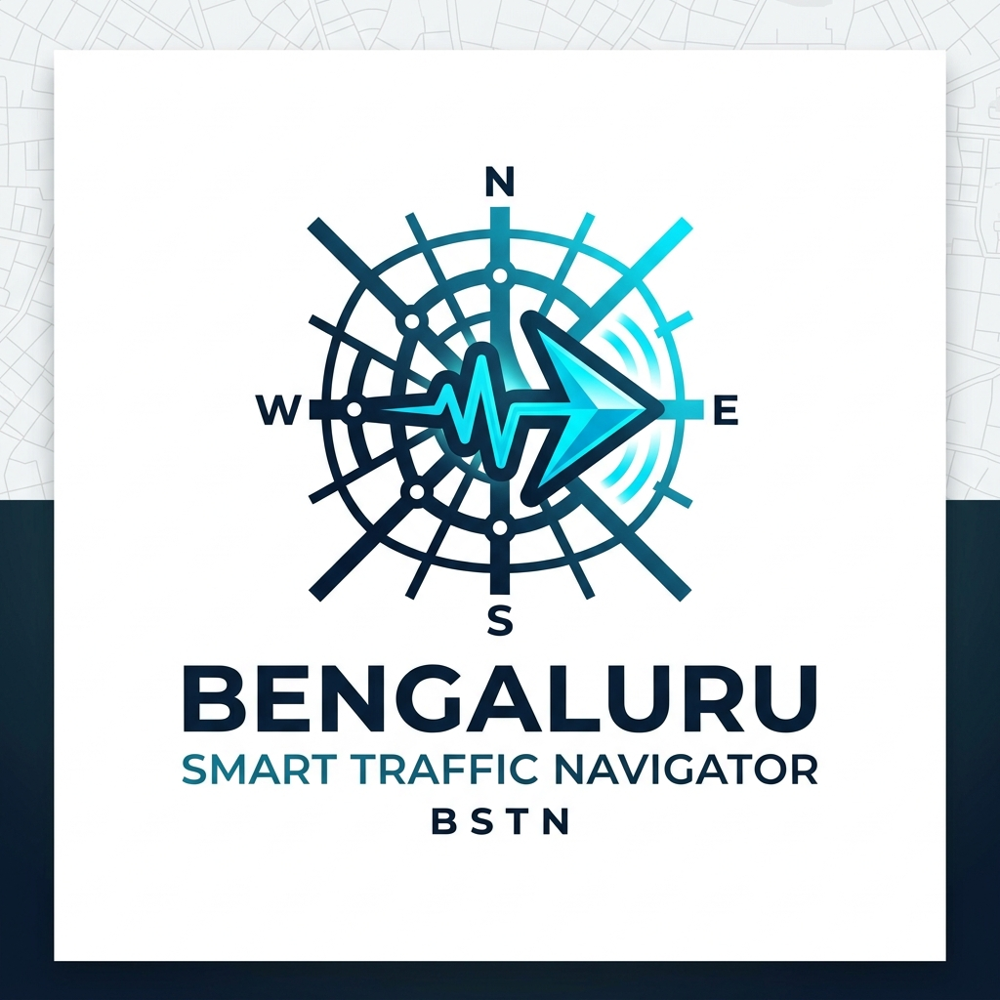
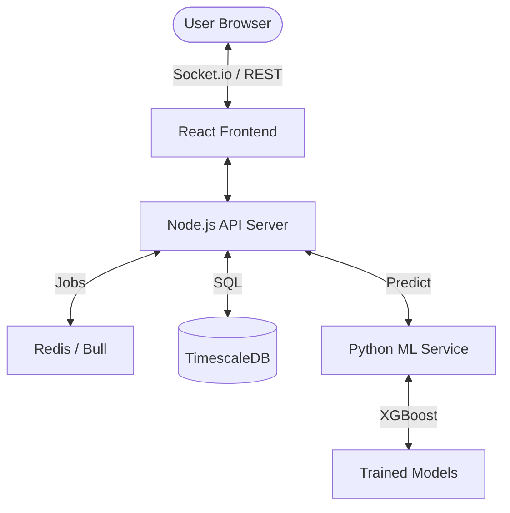

# 🚦 Bengaluru Smart Traffic Navigator

[](https://github.com/your-username/traffic/blob/master/LICENSE)
[](http://makeapullrequest.com)
[](https://www.docker.com/)

<p align="center">
  
</p>

## 🌟 Overview
The **Bengaluru Smart Traffic Navigator** is a comprehensive, full-stack solution designed to monitor, analyze, and optimize urban traffic flow. Leveraging real-time data, time-series analysis with **TimescaleDB**, and machine learning via **XGBoost**, the system provides actionable insights for urban planners and commuters alike.

### Key Features
- 🗺️ **Real-time Heatmap**: Interactive map visualization using Leaflet.js and D3.js showing live congestion levels across major Bengaluru arteries.
- 🔮 **Congestion Prediction**: Python-based ML service using XGBoost to predict traffic patterns based on historical data and time-slots.
- 🕒 **Time-Series Analysis**: High-performance data storage and querying using TimescaleDB (PostgreSQL extension) for historical traffic trends.
- 🚥 **Adaptive Signal Control**: Simulation of intelligent traffic signal timings that adjust based on live road density.
- 📊 **Analytical Dashboard**: Rich charts and metrics built with Recharts to visualize peak hours, busiest routes, and alert history.
- 🐳 **Microservices Architecture**: Fully containerized environment with Docker Compose for seamless deployment.

---

## 🏗️ Architecture
The system is built on a modular microservices architecture:



---

## 🛠️ Tech Stack

### Frontend
- **Framework**: React 19 (Vite)
- **Mapping**: Leaflet, React-Leaflet
- **Visualization**: D3.js, Recharts
- **Icons**: Lucide-React
- **Real-time**: Socket.io-client

### Backend
- **Runtime**: Node.js
- **Server**: Express.js
- **Database**: TimescaleDB (PostgreSQL 16)
- **Caching/Queue**: Redis & Bull
- **Communication**: Socket.io

### Machine Learning
- **Language**: Python 3.11
- **API**: FastAPI
- **Libraries**: Scikit-learn, XGBoost, Pandas

---

## 🚀 Getting Started

### Prerequisites
- Docker & Docker Compose
- Node.js (v18+) & Python (v3.11+) if running locally

### Quick Start with Docker
The easiest way to get the entire stack running is using Docker Compose:

1. Clone the repository:
   ```bash
   git clone https://github.com/your-username/traffic.git
   cd traffic
   ```

2. Start the services:
   ```bash
   docker-compose up --build
   ```

3. Access the applications:
   - **Frontend**: [http://localhost:3000](http://localhost:3000)
   - **Backend API**: [http://localhost:5000](http://localhost:5000)
   - **ML Service**: [http://localhost:8001](http://localhost:8001)

---

## 📊 Database Schema
The project utilizes **TimescaleDB** for efficient handling of time-series traffic data.

- **`roads`**: Static data for road segments, zones, and coordinates.
- **`traffic_data`**: A hypertable storing high-velocity traffic metrics (vehicle count, speed, congestion level).
- **`signals`**: Configuration for traffic junctions and adaptive timing parameters.
- **`alerts`**: System-generated warnings for severe congestion or incidents.

---

## 🧪 Development

### Manual Setup
If you wish to run services individually for development:

**Backend:**
```bash
cd backend
npm install
npm run dev
```

**Frontend:**
```bash
cd frontend
npm install
npm run dev
```

**ML Service:**
```bash
cd ml_service
pip install -r requirements.txt
uvicorn main:app --host 0.0.0.0 --port 8001
```

---

## 📝 License
This project is licensed under the MIT License - see the [LICENSE](LICENSE) file for details.

---
<p align="center">Made with ❤️ for Bengaluru Traffic</p>
